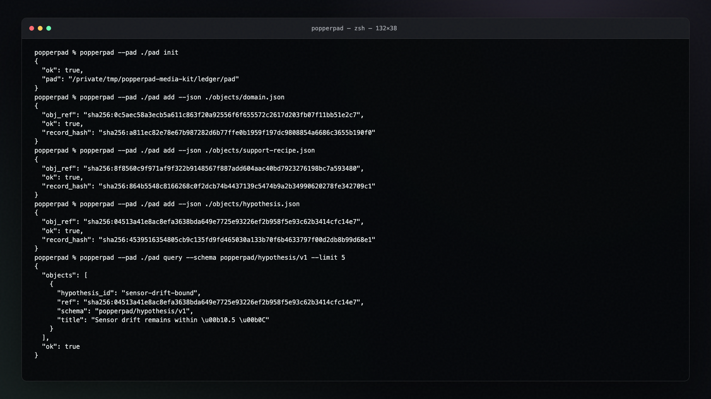
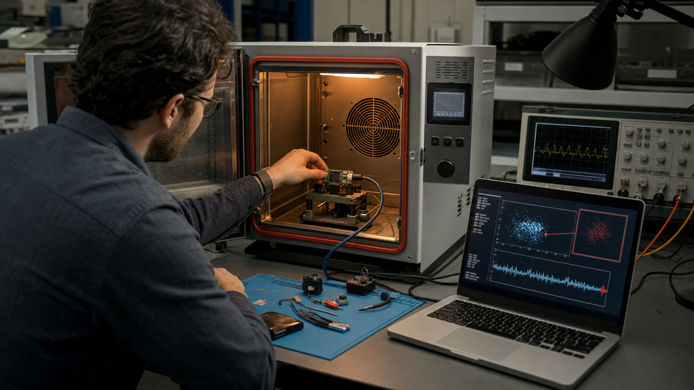
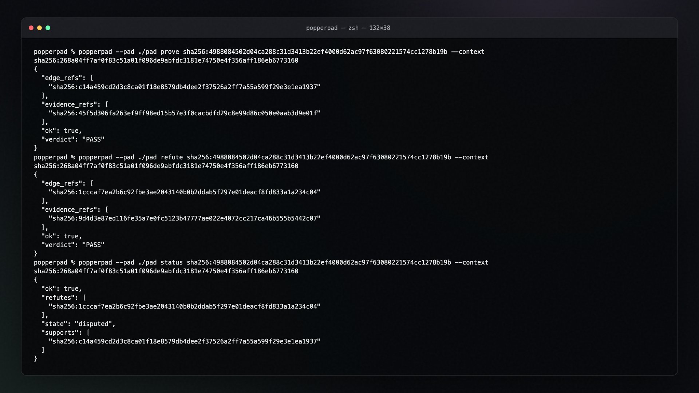

# PopperPad media kit

This kit demonstrates the actual PopperPad CLI workflow with repository-owned,
synthetic calibration data. The captures use the installed `popperpad` entry
point and retain its native JSON output, content-addressed references, evidence
edges, status derivation, and integrity report.

## CLI scenes

| Scene | Commands shown | Workflow demonstrated |
| --- | --- | --- |
| `ledger` | `init`, `add`, `query` | Initialize a pad and append immutable domain, recipe, and hypothesis objects |
| `support` | `status`, `prove`, `status` | Move from `unknown` to `supported` through replayable support evidence |
| `refute` | `refute`, `status`, `query` | Emit a counterexample artifact and derive `falsified` status |
| `dispute` | `prove`, `refute`, `status` | Retain conflicting evidence and derive `disputed` status |
| `transfer` | `add`, `transfer-paths` | Traverse a validated semantic equivalence edge |
| `integrity` | `blob-put`, `blob-get`, `checkpoint`, `doctor` | Replay a blob, checkpoint the log, and verify graph/CAS integrity |

Every scenario runs in a fresh directory under `/tmp/popperpad-media-kit`.
Recipes are deterministic, offline, fail closed, and use only relative capture
paths.

## Included assets

- Six 1920×1080 PNG terminal stills.
- Six 1920×1080 H.264 terminal clips.
- One combined PopperPad CLI workflow reel.
- Four fictional, AI-generated editorial example photos.
- Plain-text CLI transcripts.
- Reproduction scripts, publishing copy, photo prompts, and SHA-256 checksums.

The example photos depict fictional people and situations. They contain no real
customers, employees, research subjects, production systems, or captured user
data.

## Quick preview

[Watch the complete 54.9-second CLI workflow reel](videos/popperpad-cli-workflow-1920x1080.mp4).

| Append-only CLI workflow | Counterexample search |
| --- | --- |
|  |  |

| Disputed evidence | Collaborative evidence review |
| --- | --- |
|  |  |

## Reproduce the CLI assets

From the PopperPad repository root:

```bash
python3.12 -m venv .venv
.venv/bin/pip install -e '.[dev]'
mkdir -p media-kit/transcripts media-kit/images media-kit/videos
for scene in ledger support refute dispute transfer integrity; do
  .venv/bin/python media-kit/scripts/popperpad_cli_tour.py "$scene" \
    > "media-kit/transcripts/$scene.txt"
done
.venv/bin/python media-kit/scripts/render_media.py
```

The renderer needs Google Chrome and `ffmpeg`.

## Publishing guardrails

- PopperPad derives status from replayable evidence; users do not write a truth
  verdict directly.
- `supported` is scoped to the recorded recipe, inputs, and context.
- `falsified` means a retained refutation edge exists for that context.
- `disputed` intentionally preserves both support and refutation evidence.
- A clean `doctor` report verifies the pad's structural integrity, not the
  scientific truth of every hypothesis.
- Tool-optional recipes may produce `SKIP`; missing tools are not silently
  treated as success.
